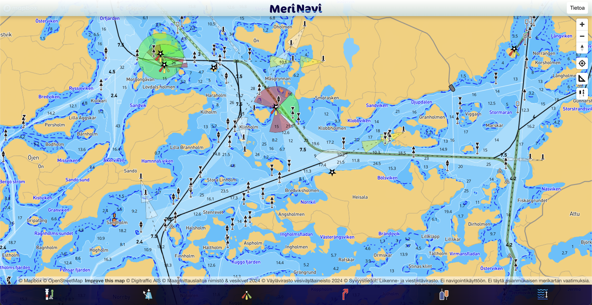
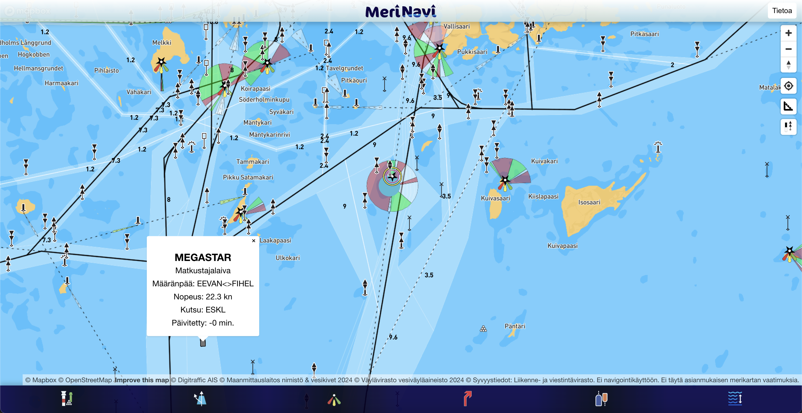

# MeriNavi React application

This React JS app is in development stage. The purpose of this app is to help the crew during sailing races (or any other sea activity) with necessary information. The map base is Mapbox GL and the data is fetched from Väylävirasto, Maanmittauslaitos, Fintraffic and Traficom.

- **Ei navigointikäyttöön. Ei täytä asianmukaisen merikartan vaatimuksia.**
- **Not for navigational use. Does not meet the requirements of nautical charts.**

[Link to current copy of app](https://ottotuhkunen.github.io/sailing-app/)

The map is designed to be used in the Finnish territorial sea.

## Features

### Map data

- Seamarks, beacons, lighthouses etc. from Väylävirasto Open Data (Jul 2024)
    - including names, position in relation to landmarks/islands and type of seamark
- Sea routes and areas from Väylävirasto Open Data (Jul 2024)
    - including published sea route depth, route type and names
- Marine traffic (AIS) from Fintraffic (Digitraffic) open data API
    - vessel names, type of vessel, speed, direction and destination
    - vessel position updates every 30 seconds
    - vessels with no position updates in the last 30 minutes are not shown
- Detailed names of islands, reefs, shore and water bodies from Maanmittauslaitos Nimistö (Jul 2024)
- Ferry and cable ferry routes and line names from Maanmittauslaitos (Jul 2024)
- Depth areas (syvyysalueet), 3 and 7 meter depth contours (syvyyskäyrät) and sounding points (syvyyspisteet) from Traficom Bathymetric data - Open depth data (Jul 2024)
- Stones located in water from Maanmittauslaitos (Jul 2024)

### Toggle buttons

- Toggle buttons in the bottom menu-bar can be used to toggle different features on and off
    - seamarks
    - routes and route area
    - light sectors and vectors
    - custom route
    - vessels (AIS)
    - depth sounding and contours

### Function buttons

- Function buttons on the right of the page are used to control the map positioning and location services.
- The ruler button will activate the distance-and-bearing tool which will draw a line from current user position to the selected location on the map.
- The button with seamarks will toggle between standard seamark map symbols and daymarks (color coded).

### Under development

- Styling, visual updates and user testing
- Peformance upgrades
- Better handling of user location
- Ability to define a route (red dotted line) in the app
    - currently only possible with an imported GeoJSON file
- Ability to define information boxes on the map (e.g. sailing race notes around the route)
    - currently only possible with an importen GeoJSON file

## Screenshots

Screenshots are taken 1 Jul 2024 and may be outdated.

App is made and updated by Otto Tuhkunen.