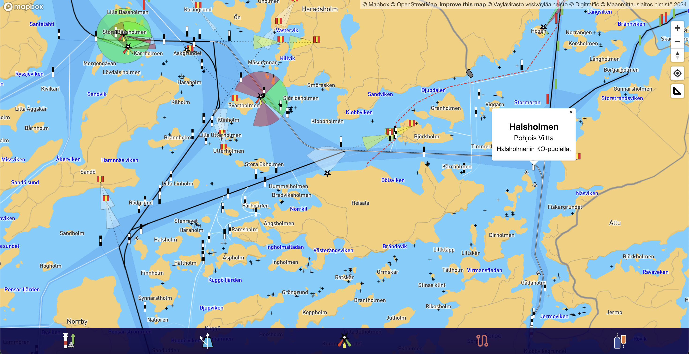

# Sailing-app

This React JS app is in development stage. The purpose of this app is to help the crew during sailing races with necessary information. The map base is Mapbox GL and the data is fetched from Väylävirasto, Maanmittauslaitos, Ilmatieteenlaitos and Fintraffic.

[Link to current copy of app](https://ottotuhkunen.github.io/sailing-app/)

The map is only functional in Finnish territorial waters, lakes and rivers.

## Features

### Map data

- Seamarks, beacons, lighthouses etc. from Väylävirasto Open Data
    - including names, position in relation to landmarks/islands and type of seamark
- Sea routes and areas from Väylävirasto Open Data
    - including published sea route depth and names
- Marine traffic (AIS) from Fintraffic (Digitraffic)
    - vessel names, type of vessel speed, direction and destination
    - vessel position updates are under development
- Detailed names of islands, reefs, shore and water bodies from Maanmittauslaitos
- Ferry and cable ferry routes and line names from Maanmittauslaitos

### Under development
- Toggle buttons on the bottom menu bar are working but not changing states visually
- Current location and direction of travel (under development)
- Ability to define a route (red dotted line) in the app
    - currently only possible with an imported GeoJSON file
- Ability to define information boxes on the map (e.g. sailing race notes around the route)
    - currently only possible with an importen GeoJSON file
- Visual updates and user testing
- Performance updates

## Images

App is made and updated by Otto Tuhkunen.